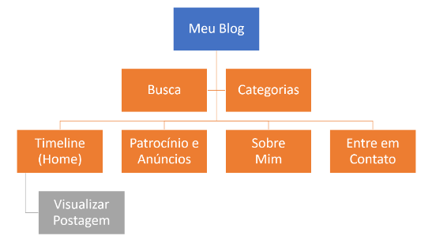
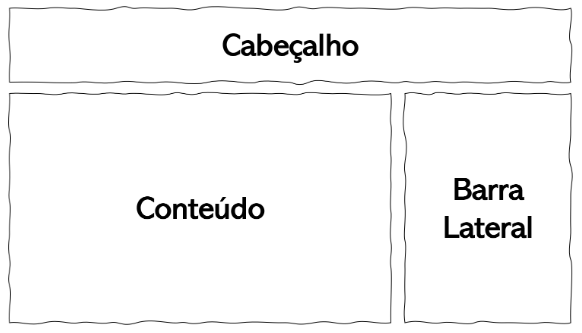
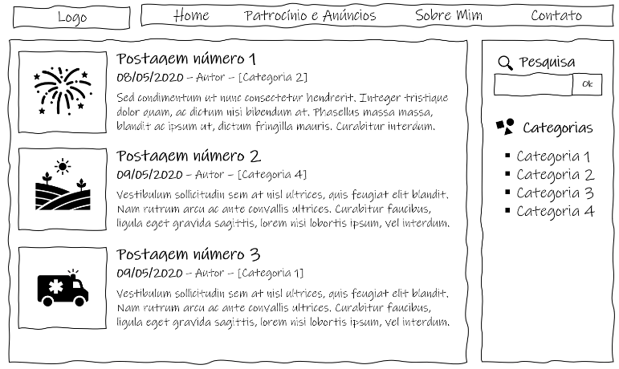
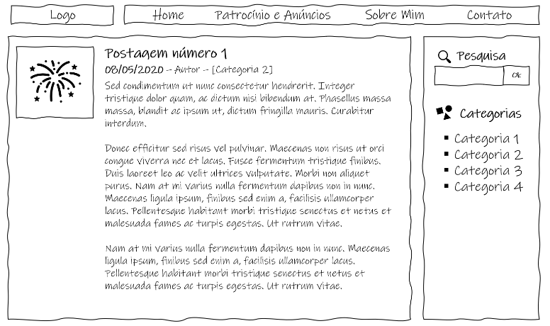
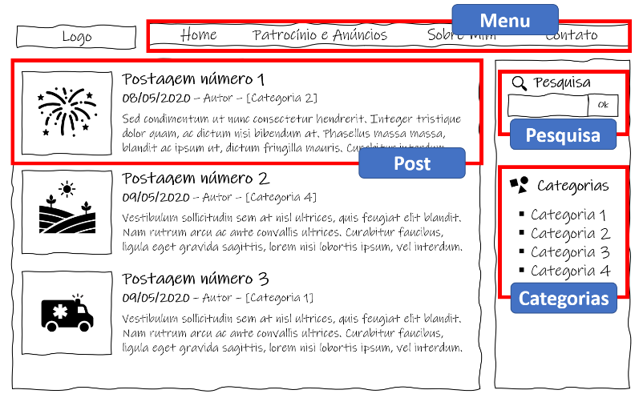

# 01 - Site de Blog (Parte HTML)

Nessa atividade, vamos construir o site para um Blog pessoal. Teremos uma página principal que exibe as postagens e permite acessar outras sessões como patrocínios e anúncios, uma página sobre o autor e uma página para envio de contatos.

Nosso principal objetivo é aprender detalhes do HTML e em função disso, não vamos nos preocupar com a dinâmica de alteração do conteúdo do site, ou seja, as postagens. Chamamos isso de sites estático, pois ele sempre mostra a mesma coisa. Por ora, é o que precisamos.

Temos várias estratégias para conseguir vencer desafios, e eu recomendo a você que planeje antes de iniciar. Você já ouviu que a forma mais fácil de comer um elefante é por meio de uma dentada de cada vez? Pois vamos fazer isso com nosso site: **dividir para conquistar**.

Para isso, vamos trabalhar com a seguinte estratégia:

## Mapa do Site

Antes de começar a programar, é preciso pensar no que vamos construir. Vamos começar identificando as páginas e as funcionalidades que o site deve apresentar. Para isso, vamos construir uma hierarquia que será chamada de **mapa do site**. Nessa estrutura, vamos relacionar todas as páginas que nosso site deve ter e como estas páginas são organizadas. O diagrama abaixo mostra uma sugestão de páginas para o nosso Blog.



## Protótipos de telas (Wireframes)

Agora que já sabemos as páginas que devemos criar, chegou a hora de imaginar o que deve ter em cada uma destas páginas. Para isso, vamos utilizar uma prototipação de baixa fidelidade, ou seja, algo rápido que dá apenas uma ideia do nosso produto final, mas nos ajuda a pensar no que será feito. Nesse ponto, vamos pensar na estrutura inicial que vai organizar todas as páginas do site e depois, tela a tela.

Para começar, fiz uma proposta de estrutura do nosso site que identifica três grandes áreas: o cabeçalho, o conteúdo e uma barra lateral. Veja o esquema na imagem que se segue.



Agora, vamos pensar no detalhamento da nossa página principal. Nesta página, teremos a exibição das postagens, um menu com as demais páginas, uma caixa que permite a pesquisa de textos das postagens e um submenu para as categorias de postagens do Blog. Veja esta tela na imagem que se segue.



Nesta última sugestão, vamos montar a tela em que o usuário do nosso Blog visualizará uma postagem específica. Veja na imagem que se segue.



## Componentes

Na estratégia de dividir para conquistar, é importante identificar como separar o nosso desafio em partes e trabalhar com uma parte por vez. Ao observar o site que pretendemos criar é possível identificar pedaços que podem se repetir várias vezes no nosso site. Se olharmos com cuidado para a página principal, podemos identificar algumas destas partes que vamos chamar de componentes: (1) o menu, (2) uma postagem simples, (3) a caixa de pesquisa, (4) a caixa de categorias. Veja na imagem a seguir a separação de cada um destes componentes.



Ao dividir o seu site em componentes, fica fácil de montar cada coisa e reutilizar isso, sempre que necessário. Um bom exemplo são as postagens, definindo a estrutura deste componente por meio de seus elementos (imagem de destaque, título, subtítulo com data, autor e categoria e texto introdutório), depois basta replicar e alterar o conteúdo de cada um destes elementos. Isso torna o nosso site profissional e mais fácil de ser entendido pelos nossos usuários, o que é um dos aspectos da usabilidade que melhoram a experiência do usuário, o que chamamos de **UX (User Experience)**.

## Código HTML

Agora que já temos o site dividido, chegou a hora de conquistar. Vamos montar um código HTML para cada uma destas partes. Vamos lá.

### Estrutura do site

Para essa parte, você pode ficar em dúvida do que usar e isso é normal para quem está começando. Convido você a ver os seguintes conteúdos do curso, nessa ordem:

-   videoaula sobre a [Sintaxe do HTML](https://pucminas.instructure.com/courses/197083/pages/unidade-2-2-sintaxe-da-linguagem-html),
-   videoaula sobre os [Elementos de Metadados](https://pucminas.instructure.com/courses/197083/pages/unidade-2-3-elementos-de-metadados) e
-   videoaula sobre os [Elementos de Estrutura](https://pucminas.instructure.com/courses/197083/pages/unidade-2-6-elementos-estruturais).

Com isso, saímos com a primeira parte do nosso site. Crie um arquivo com o nome index.html e transcreva o seguinte trecho de código:

```html
<!DOCTYPE html>
<html lang="en">
    <head>
        <meta charset="UTF-8" />
        <meta name="viewport" content="width=device-width, initial-scale=1.0" />
        <title>Blog do Rommel</title>
    </head>
    <body>
        <!-- Cabeçalho -->
        <header></header>

        <!-- Conteúdo do site -->
        <main></main>

        <!-- Barra lateral -->
        <aside></aside>
    </body>
</html>
```

Este é a nossa página inicial. O nome index.html é utilizado pelos principais servidores da Web para localizar a primeira página de um site. Sempre que criar um novo site, utilize este padrão para sua página principal.

**IMPORTANTE**: Não se preocupe ainda com o posicionamento de cada coisa no site. Isso virá depois com o uso do CSS.

### Componente Menu

Para esta parte do site, convido vocês a assistirem a videoaula sobre os [Elementos Textuais do HTML](https://pucminas.instructure.com/courses/197083/pages/unidade-2-4-elementos-de-texto-e-multimidia).

Inicialmente, a grande maioria das pessoas, inicialmente, pensam em criar uma tabela para montar o menu e eu entendo bem. Porém, devemos pensar que o HTML não é responsável por dar a forma do nosso site, mas definir a estrutura do conteúdo, e chegamos na eterna discussão sobre forma vs conteúdo. Pois é, o HTML é responsável pelo conteúdo e não se preocupa, em primeira instância, com a forma, isso é tarefa para o CSS.

Diante disso, o menu nada mais é que uma lista de opções. Por conta disso, vamos utilizar o elemento HTML de listas e não a tabela, ok? Mais a frente vamos trabalhar com o CSS para que o nosso menu fique da forma como queremos.

Com isso, o nosso código HTML fica muito simples, porém com um significado importante que o Google vai gostar de ver quando estiver indexando o seu site. Veja como o código HTML fica simples e muito consistente.

```html
<nav class="menu-principal">
    <ul>
        <li><a href="index.html">Home</a></li>
        <li><a href="patrocinio.html">Patrocínio e Anúncios</a></li>
        <li><a href="sobre.html">Sobre Mim</a></li>
        <li><a href="contato.html">Contato</a></li>
    </ul>
</nav>
```

Perceba que cada opção faz o link para uma página diferente. Você deverá criar um novo arquivo para cada uma destas páginas com o nome exato que se encontra no conteúdo do atributo href e replicar o código da estrutura e deste menu. Vamos utilizar o atributo class para identificar a classe deste menu que será utilizada no CSS para formatar esse componente.

Agora, inclua este código dentro do elemento header da estrutura do site, criada no item anterior no arquivo **_index.html_**. Veja como fica o código:

```html
...
<!-- Cabeçalho -->
<header>
    <nav class="menu-principal">
        <ul>
            <li><a href="index.html">Home</a></li>
            <li><a href="patrocinio.html">Patrocínio e Anúncios</a></li>
            <li><a href="sobre.html">Sobre Mim</a></li>
            <li><a href="contato.html">Contato</a></li>
        </ul>
    </nav>
</header>
...
```

**IMPORTANTE**: Sites que utilizam os elementos corretos são melhor posicionados pelo Google e outros buscadores quando alguém pesquisa pelo conteúdo que você tem. Fique atento e saiba fazer um site que os outros vão encontrar e gostar de usar.

### Componente Postagem

Para esta parte, será importante que você tenha assistido a videoaula sobre os [Elementos Multimídia](https://pucminas.instructure.com/courses/197083/pages/unidade-2-4-elementos-de-texto-e-multimidia), que explicam como utilizar as imagens.

O nosso componente de postagem possui vários elementos e vamos utilizar atributos do tipo class para identificar cada um deles. Isto será utilizado no código CSS para formatar cada parte do nosso post. Veja o código.

```html
<div class="caixa-post">
    
    <h3 class="titulo">Postagem numero 1</h3>
    <div class="subtitulo">
        <span class="data">08/05/2020</span> - <span class="autor">Rommel Carneiro</span> -
        <span class="categorias">[Categoria 2]</span>
    </div>
    <p class="texto">
        Lorem ipsum dolor sit, amet consectetur adipisicing elit. Sequi suscipit corporis est iure distinctio modi,
        atque fuga odit quasi dicta omnis veritatis enim. Commodi, vero.
    </p>
</div>
```

Inclua esse código na dentro do elemento main do arquivo **_index.html_**. Agora que temos a estrutura de um post, podemos replicar para os demais e alterar o conteúdo.

### Componente Pesquisa

Nesta parte, convidamos você a assistir a videoaula sobre os [Elementos Avançados](https://pucminas.instructure.com/courses/197083/pages/unidade-2-7-elementos-de-formularios-e-avancados) que passa rapidamente sobre os Formulários. Para mais detalhes, sugiro que consulte também o site do [W3Schools sobre formulários](https://www.w3schools.com/html/html_forms.asp)

```html
<div class="caixa-pesquisa">
    <input type="text" class="texto_pesquisa" />
    <button class="botao_ok">Ok</button>
</div>
```

Inclua esse código na dentro do elemento aside do arquivo **_index.html_**.

### Componente Categorias

Neste componente, vamos listar as categorias de postagem. Como estamos apenas exercitando os elementos HTML em um site estático, esta seção será apenas ilustrativa, sem links reais para cada seção, efetivamente. Veja o código:

```html
<div class="caixa-categoria">
    <ul>
        <li><a href="#">Categoria 1</a></li>
        <li><a href="#">Categoria 2</a></li>
        <li><a href="#">Categoria 3</a></li>
        <li><a href="#">Categoria 4</a></li>
    </ul>
</div
```

Inclua esse código na dentro do elemento aside do arquivo **_index.html_**.

Pronto, nosso site está começando a sair do papel. Espero que tenha compreendido como aplicar cada elemento da linguagem HTML.

Agora é com você. Crie as outras páginas, reutilize o código que se repete em cada página e deixe o seu site preparado para o próximo Mao na Massa em que vamos formatar o site com a Linguagem CSS.
